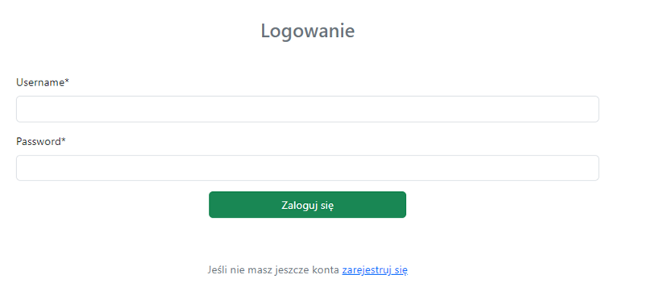
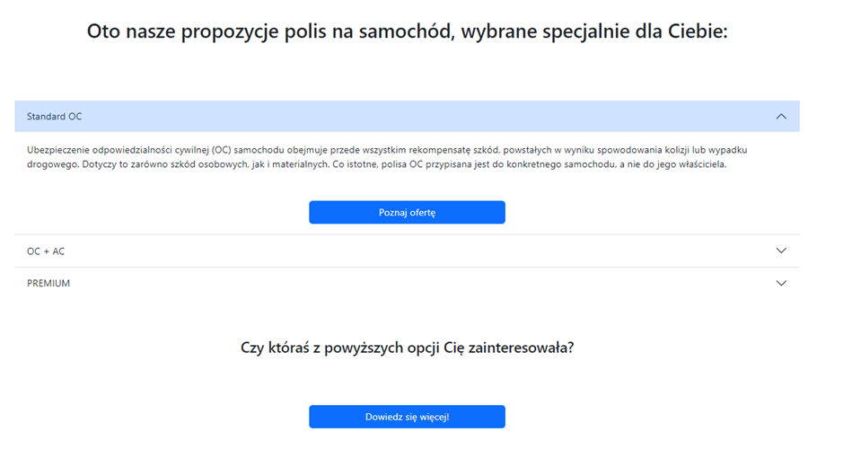
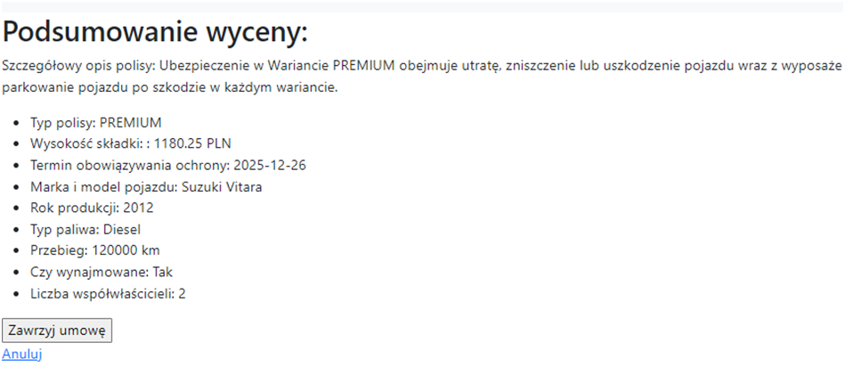
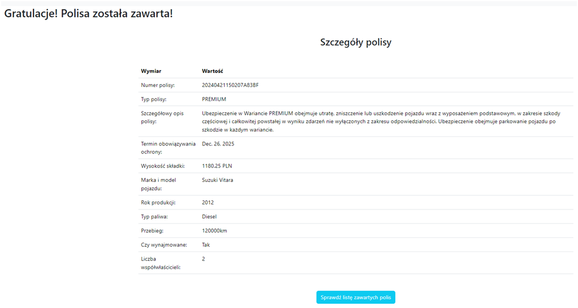
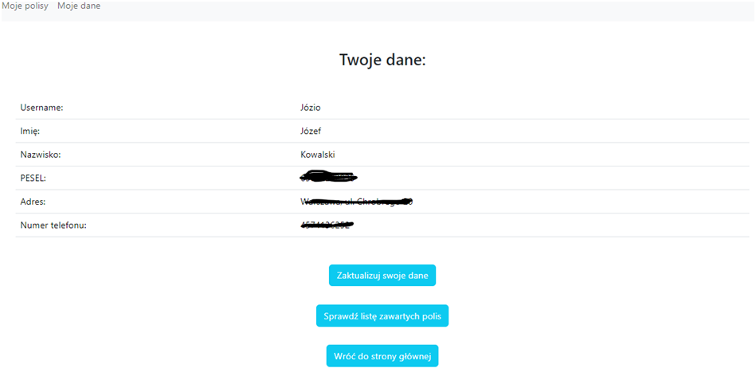

# 📑 System Zarządzania Polisami

### Witaj w Systemie Zarządzania Polisami - projekcie grupowym stworzonym przez:

#### - Piotr Borecki

[](https://github.com/petermarkb)
[](https://www.linkedin.com/in/piotr-borecki/)

#### - Arkadiusz Cioroch

[](https://github.com/arek001c)


#### - Monika Ślimak

[](https://github.com/snaila)
[](www.linkedin.com/in/monika-ślimak/)

)

---

## Spis treści

1. [Wstęp](#-1-wprowadzenie)
2. [Wykorzystane technologie](#-2-wykorzystane-technologie)
3. [Rejestracja i autoryzacja](#-3-rejestracja-i-autoryzacja)
4. [Główne funkcje](#-4-g%C5%82%C3%B3wne-funkcje)
5. [Rozpoczęcie pracy](#-5-rozpocz%C4%99cie-pracy)
6. [Struktura projektu](#-8-struktura-projektu)
7. [Szybki podgląd](#-9-szybki-podgl%C4%85d)
8. [Licencja](#-10-licencja)


---

## 💥 1. Wprowadzenie

System Zarządzania Polisami to rozwiązanie, które umożliwia zarządzanie Twoimi polisami ubezpieczeniowymi. Dzięki niemu możesz szybko i skutecznie obsługiwać polisy, śledzić terminy zakończenia ochrony i zawierać nowe ubezpieczenia.

---

## 🕹 2. Wykorzystane technologie

- Frontend:
  - **HTML/CSS/JavaScript**: Wykorzystane do budowy interfejsu użytkownika.
  - **Bootstrap 5**: Użyto do responsywnego projektowania i stylizacji komponentów interfejsu.

- Backend:
  - **Django**: Framework Pythona wykorzystany do budowy aplikacji webowej.

- Baza danych:
    - **SQLite**: Wykorzystano bazę danych SQLite (`db.sqlite3`) do przechowywania danych aplikacji.


---

## 🔐 3. Rejestracja i autoryzacja

System Zarządzania Polisami zapewnia bezpieczne procesy rejestracji i autoryzacji dla wszystkich użytkowników. Podczas rejestracji nowego użytkownika, system automatycznie generuje unikalny numer polisy, który można wykorzystać do późniejszych operacji.

Dodatkowo system umożliwia klientom rejestrację nowych kont lub logowanie się na istniejące już konta. Podczas rejestracji wymagany jest unikalny numer PESEL, który służy jako identyfikator użytkownika.

---


- **Rejestracja użytkowników:**
  - Użytkownicy mają możliwość rejestracji na stronie rejestracji (RegisterView), która jest dostępna dla niezalogowanych użytkowników.
  -	Formularz rejestracyjny (CustomUserForm i CustomerForm) pozwala użytkownikom wprowadzić swoje dane, takie jak login,  imię, nazwisko, numer PESEL, adres, numer telefonu oraz hasło. 
  -	Numer PESEL wprowadzony przez użytkownika jest walidowany za pomocą sumy kontrolnej, a także sprawdzana jest jego unikalność w bazie danych. Jeśli numer PESEL już istnieje w bazie, użytkownik otrzymuje odpowiedni komunikat.
  -	Dane wprowadzone przez użytkownika są walidowane, w tym poprawność imienia i nazwiska- wymagalność wprowadzenia formatu za pomocą z dużych liter .
  -	Po udanej rejestracji, użytkownik zostaje przekierowany na stronę logowania.

- **Logowanie:**
	- Logowanie użytkowników odbywa się na stronie logowania, gdzie użytkownicy wprowadzają swój login i hasło.
	- W przypadku poprawnych danych logowania, użytkownik zostaje przekierowany na stronę główną aplikacji. W przeciwnym razie wyświetlany jest komunikat o błędnych danych logowania.

- **Autoryzacja i uprawnienia:**
	- Wszystkie widoki związane z dostępem do danych użytkownika (takie jak CustomerDetailView i CustomerUpdateView) sprawdzają, czy użytkownik jest zalogowany oraz czy jest właścicielem profilu klienta, aby zapewnić odpowiednie uprawnienia.
- **Bezpieczeństwo:**
	- Formularze rejestracji i logowania zawierają pola tokena CSRF, co zapobiega atakom typu CSRF.
	- Numer PESEL wprowadzony przez użytkownika jest walidowany i sprawdzany w bazie danych, aby zapewnić unikalność.
	- Sprawdzana jest poprawność imienia i nazwiska podczas rejestracji.

---
## 🔑 4. Główne funkcje


- **Zarządzanie polisami ubezpieczeniowymi:**
	- **Przeglądanie Ofert:** Klient może z łatwością przeglądać oferty ubezpieczeń podzielone na rodzaje, takie jak polisy samochodowe i polisy majątkowe.
	- **Rejestracja/Logowanie:** System umożliwia klientom rejestrację nowych kont lub logowanie się na istniejące już konta. Podczas rejestracji wymagany jest unikalny numer PESEL, który służy jako identyfikator użytkownika.
	- **Wypełnianie Formularzy:** Po zalogowaniu i zdecydowaniu się na którąś z ofert, klient ma możliwość zakupu danej oferty, uzupełniając odpowiedni formularz dotyczący wybranego typu polisy. Wypełnia wymagane pola, aby sprawdzić szczegółowe warunki i wysokość składki ubezpieczeniowej.
	- **Podsumowanie Oferty:** Po obliczeniu składki klient otrzymuje podsumowanie warunków polisy, w tym wysokość składki. Może również zdecydować się na anulowanie procesu zawierania umowy.
	- **Zawieranie Umowy:** Po zaakceptowaniu warunków klient może zawrzeć umowę, a polisa zostanie dodana do listy jego polis i przypisana do konta.
	- **Przeglądanie Polis:** Klient ma dostęp do swojej podstrony, gdzie może zobaczyć wszystkie zawarte polisy. Może również przeglądać szczegóły zakupionych polis, śledzić terminy zakończenia ochrony oraz zawrzeć nowe ubezpieczenia.
- **Rejestracja i logowanie:**
	- Użytkownicy mają możliwość rejestracji nowego konta poprzez formularz rejestracyjny.
	- Istniejący użytkownicy mogą zalogować się na swoje konto za pomocą loginu i hasła.
- **Edycja danych osobowych:**
	- Zarejestrowani użytkownicy mogą edytować swoje dane kontakowe, takie jak adres oraz numer telefonu  na swojej podstronie profilowej.
    - Możliwa jest również zmiana dotychczasowego hasła
- **Autoryzacja i bezpieczeństwo:**
	- Dostęp do poszczególnych funkcji aplikacji jest kontrolowany za pomocą mechanizmów autoryzacji Django, zapewniających bezpieczeństwo danych użytkowników.
	- Formularze rejestracji i logowania są zabezpieczone przed atakami typu CSRF.
	- Numer PESEL wprowadzany podczas rejestracji jest walidowany i sprawdzany w bazie danych w celu zapewnienia jego unikalności.

    

---
## 🧾 5. Rozpoczęcie pracy

Ten przewodnik przeprowadzi Cię przez kroki wymagane do skonfigurowania i uruchomienia aplikacji Insurance_company. Możesz skonfigurować aplikację ręcznie.

### 5.1. Wymagania wstępne

Zanim rozpoczniesz, upewnij się, że masz zainstalowane następujące elementy na swoim systemie:

- Git
- Python 3.11 lub nowszy
- pip (menedżer pakietów Pythona)
- Docker (dla konfiguracji Docker'a)
- Znajomość stron internetowych: docker.com, cloudinary.com.

### 5.2. Sklonuj repozytorium

Sklonuj repozytorium `Insurance_company` na komputer lokalny, używając następującego polecenia:

```bash
git clone https://github.com/grupa-B-PK/app_zarzadzanie_polisami.git 
```


### 5.3. Skonfiguruj zmienne środowiskowe 

Musisz skonfigurować zmienne środowiskowe dla ustawień Django. 
Można to zrobić tworząc plik .env w katalogu głównym projektu i wypełniając go niezbędnymi wartościami:

```
SECRET_KEY=
DEBUG=
```

Upewnij się, że plik .env jest bezpieczny i nigdy nie przesyłaj go do repozytorium, aby chronić poufne informacje.

### 5.4. Zainstaluj zależności

Przejdź do katalogu sklonowanego repozytorium i zainstaluj wymagane zależności

```
pip install -r requirements.txt
```
- **Utwórz bazę danych i wypełnij ją danymi**

Przed uruchomieniem poniższych poleceń upewnij się, że jesteś w katalogu ```\app_zarzadzanie_polisami\Insurance_company```

```
python manage.py makemigrations 
python manage.py migrate
python manage.py loaddata fixtures/accounts.json 
python manage.py loaddata fixtures/insurance_app.json
```

- Zarejestruj się, aby uzyskać pełny dostęp do funkcjonalności
- Możesz również skorzystać z konta testowego używając danych:
  -  login: ```admin1```, password: ```admin```


- **Uruchom aplikację** 

```
python manage.py runserver
```

Aplikacja będzie dostępna pod adresem: ```http://localhost:8000```


Ciesz się korzystaniem z naszego serwisu!

## 🧾 6. Struktura projektu
```angular2html
app_zarzadzanie_polisami
├── README.md
├── requirements.txt
|   .gitignore
|   __init__.py 
|── Insurance_company
│   ├── fixtures
│   │   └── accounts.json
│   │   └── insurance_app.json
|   manage.py
|   struktura_projektu.txt
|   __init__.py  
|	+---accounts
|	|   |   admin.py
|	|   |   apps.py
|	|   |   forms.py
|	|   |   models.py
|	|   |   tests.py
|	|   |   urls.py
|	|   |   views.py
|	|   |   __init__.py
|	|   |   
|	|   +---migrations
|	|   |   |   0001_initial.py
|	|   |   |   __init__.py
|	|   +---templates
|	|   |   \---accounts
|	|   |           customer_detail.html
|	|   |           customer_update.html
|	|   |           logged_out.html
|	|   |           login.html
|	|   |           logout.html
|	|   |           password_change.html
|	|   |           register.html
|	|           
|	+---insurance_app
|	|   |   admin.py
|	|   |   apps.py
|	|   |   forms.py
|	|   |   logic_temp.py
|	|   |   models.py
|	|   |   tests.py
|	|   |   urls.py
|	|   |   views.py
|	|   |   __init__.py
|	|   |   
|	|   +---migrations
|	|   |   |   0001_initial.py
|	|   |   |   __init__.py
|	|   |   |
|	|   +---templates
|	|   |       404.html
|	|   |       base.html
|	|   |       index.html
|	|   |       main_page.html
|	|   |       offer_car.html
|	|   |       offer_house.html
|	|   |       policy_car_confirm.html
|	|   |       policy_car_create.html
|	|   |       policy_car_detail.html
|	|   |       policy_house_confirm.html
|	|   |       policy_house_create.html
|	|   |       policy_house_detail.html
|	|   |       policy_list.html
|	+---Insurance_company
|	|   |   asgi.py
|	|   |   settings.py
|	|   |   urls.py
|	|   |   wsgi.py
|	|   |   __init__.py
|	|           
|	+---static
|	|   |   custom-styles.css
|	|   |   
|	|   \---images
|	|           car-insurance-logo.jpg
|	|           car-insurance-logo.png
|	|           
|	+---utils
|── |   |   validators.py


```

## 7.Szybki podgląd
Poniżej znajdziesz kilka zrzutów ekranu z naszej aplikacji.

**Logowanie:**



**Widok proponowanych ofert:**



**Widok listy polis użytkownika:**


**Podsumowanie wyceny:**



**Zawarcie umowy i przykładowe szczegóły polisy:**



**Przykładowy widok profilu użytkownika:**




## 📄8. Licencja
Private.

🔥 Dzięki za wybranie Insurance company!
 
Zapraszamy do testowania!